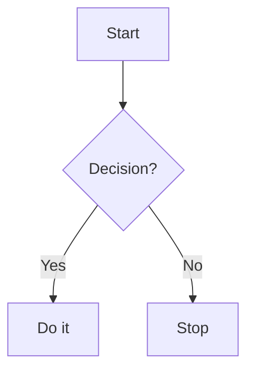

# Workshop 7 - I2C protocol and State Machine

⚠️ This section is still in progress.

Blocos colapsáveis

??? note "See more details"
    This content is hidden by default.


lista com emojis

- :material-lightbulb: Idea
- :material-cog: Configuration
- :material-code-tags: Code Example


??? info "Feature table"
    | Feature | Description |
    |----------|-------------|
    | :rocket: Speed | Very fast |
    | :lock: Security | Strong encryption |


!!! info "Quick summary"
    **Goal:** Summarize what students will learn here.



> 💬 *“Code is like humor. When you have to explain it, it’s bad.”*  
> — Cory House

- [x] Completed tutorial 1
- [ ] Finish tutorial 2


# Summary

!!! success "Goal Achieved!"
    You’ve completed the first tutorial successfully 🎉

=== "Python"
    ```python
    print("Hello!")
    ```
=== "C"
    ```c
    printf("Hello!");
    ```

??? info "How it works"
    The function reads the sensor value and prints it.

- :material-chip: Reads data from ADC  
- :material-flash: Controls LED output

!!! tip
    This is a helpful tip!

!!! note
    A neutral note box.

!!! warning
    Be careful — this is important!

!!! danger
    Something went wrong.

!!! success
    The operation completed successfully.

!!! tip "Pro Tip"
    You can override the title like this.

!!! note "Details"
    You can even nest admonitions.

    !!! tip
        Nested tip inside a note!


| Tipo       | Visual         | Uso típico                |
| ---------- | -------------- | ------------------------- |
| `note`     | 📝 Azul        | Informação neutra         |
| `tip`      | 💡 Verde       | Dicas e sugestões         |
| `warning`  | ⚠️ Amarelo     | Cuidados                  |
| `danger`   | 🔥 Vermelho    | Erros críticos            |
| `example`  | 📘 Azul escuro | Exemplos                  |
| `quote`    | 💬 Cinza       | Citações                  |
| `abstract` | 📚 Roxo        | Resumos de seções         |
| `info`     | ℹ️ Azul claro  | Notas informativas        |
| `success`  | ✅ Verde escuro | Confirmações / conclusões |
