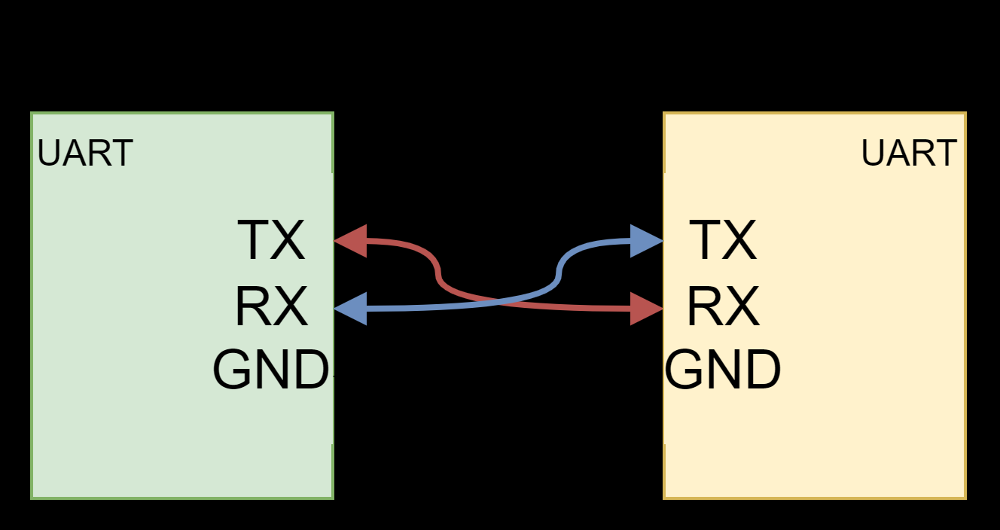

# Tutorial 3 - UART and ADC



## OUTPUT

## INPUT

### Example: User inputs Through UART comm.

```cpp
void setup() {
  Serial.begin(115200);
  Serial.println("Enter a number and press Enter:");
}

void loop() {
  if (Serial.available() > 0) { // only starts if the serial communication is active
    int value = Serial.parseInt();   // read an integer number from serial
    Serial.print("You entered: ");
    Serial.println(value);

    if (value > 5) {
      Serial.println("The entered value is greater than 5");
    } else if (value < 5) {
      Serial.println("The entered value is less than 5");
    } else {
      Serial.println("The entered value is equal to 5");
    }
    Serial.println("\nEnter another number:");
  }
}
```

## Variable Types

This table shows the variable types commonly used in Arduino C, their memory size, and value ranges.  
Note: sizes and ranges depend on the board architecture (8-bit AVR vs 32-bit ESP32/ARM).

| Type (C/Arduino)        | Bytes (AVR 8-bit) | Range (AVR 8-bit)                           | Bytes (ESP32/ARM 32-bit) | Range (ESP32/ARM 32-bit)                           |
|--------------------------|------------------:|---------------------------------------------|-------------------------:|---------------------------------------------------|
| `bool` / `boolean`       | 1                 | `false` / `true`                            | 1                        | `false` / `true`                                  |
| `char` (signed)          | 1                 | −128 to 127                                 | 1                        | −128 to 127                                       |
| `unsigned char` / `byte` | 1                 | 0 to 255                                    | 1                        | 0 to 255                                          |
| `short`                  | 2                 | −32,768 to 32,767                           | 2                        | −32,768 to 32,767                                 |
| `unsigned short`         | 2                 | 0 to 65,535                                 | 2                        | 0 to 65,535                                       |
| `int`                    | 2                 | −32,768 to 32,767                           | 4                        | −2,147,483,648 to 2,147,483,647                   |
| `unsigned int`           | 2                 | 0 to 65,535                                 | 4                        | 0 to 4,294,967,295                                |
| `long`                   | 4                 | −2,147,483,648 to 2,147,483,647             | 4                        | −2,147,483,648 to 2,147,483,647                   |
| `unsigned long`          | 4                 | 0 to 4,294,967,295                          | 4                        | 0 to 4,294,967,295                                |
| `long long`              | 8                 | −9,223,372,036,854,775,808 to 9,223,372,036,854,775,807 | 8 | same |
| `unsigned long long`     | 8                 | 0 to 18,446,744,073,709,551,615             | 8                        | same                                              |
| `float`                  | 4                 | ~±3.4×10^38 (≈6–7 digits precision)         | 4                        | ~±3.4×10^38 (≈6–7 digits precision)               |
| `double`                 | 4 *(same as float)* | ~±3.4×10^38 (≈6–7 digits precision)       | 8                        | ~±1.7×10^308 (≈15–16 digits precision)            |
| `size_t`                 | 2                 | 0 to 65,535                                 | 4                        | 0 to 4,294,967,295                                |

---

### Notes

- Ranges assume two’s-complement integers and IEEE-754 floating-point representation.
- On **AVR boards (e.g., Arduino Uno, Nano)**, `double` is the same as `float` (32-bit).
- On **ESP32/ARM boards**, `double` is 64-bit.
- `byte` is simply an alias for `unsigned char`.


### Types of Variables

lembra que usamos no tutorial 3 

Serial.printl

e agora estamos usando 

Serial.printf()

o bacana que agora está convertendo


tipos de variaveis 

- int de 2 a 4 bytes

### Assigning a value to a variable


#### Exercise


[Solution](exercises/exercise1/exercise1.ino)

## Next Tutorial

Go to [Tutorial 4](../tutorial4/ReadMe.md) - Variables, Data types, If and Loops.

Back to [main page](../../README.md).
